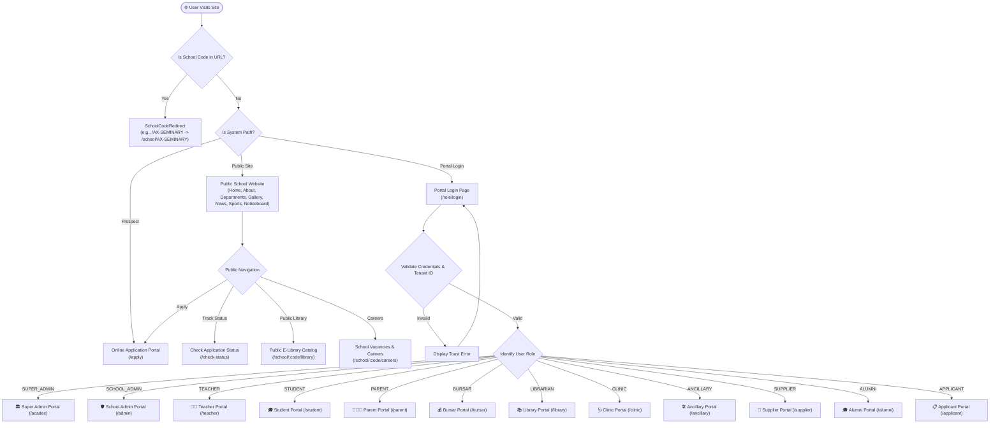
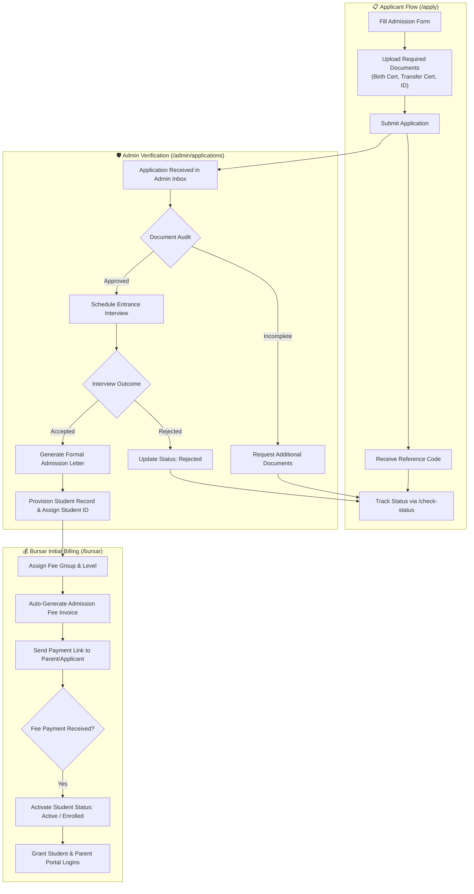
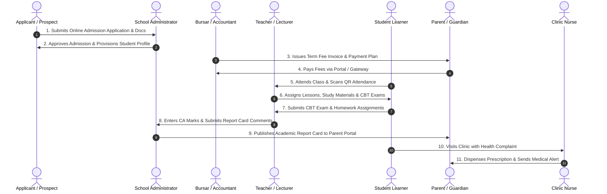

# SKULAS School ERP — Complete Master Flowchart & System Diagrams

This document contains complete, end-to-end Mermaid flowchart diagrams mapping every user role, portal navigation route, decision node, operational workflow, and cross-portal data integration across **SKULAS ERP**.

---

## 1. Master System Entry & Multi-Portal Authentication Routing

---

## 2. Admissions & Onboarding Workflow

---

## 3. School Admin Configuration & Management Flow (`/admin`)

```mermaid
flowchart TD
    subgraph AdminDashboard ["🛡️ Admin Dashboard & Setup"]
        Setup["Setup Wizard (/admin/setup)"] --> S1["Regional Preferences & Currency"]
        S1 --> S2["Branding, Logos & Favicon"]
        S2 --> S3["Website CMS & Noticeboard"]
        S3 --> S4["ID Card & Document Templates"]
    end

    subgraph UserMgmt ["User & Staff Management"]
        U1["User Management (/admin/users)"] --> U2["Create User via AdminUserCreateModal"]
        U2 --> U3{"Assign Primary Role"}
        U3 -->|"Teacher/Bursar/Staff"| U4["Assign HR Profile & Up to 4 Secondary Roles"]
        U3 -->|"Student"| U5["Assign Class, Section & Guardian Details"]
    end

    subgraph AcademicOps ["Academic Operations"]
        Ac1["Classes Management (/admin/classes)"] --> Ac2["Define Levels & Sections"]
        Ac2 --> Ac3["Assign Class Teachers"]
        Ac1 --> Ac4["Subject Catalog (/admin/subjects)"]
        Ac4 --> Ac5["Assign Subject Teachers"]
        Ac1 --> Ac6["Execute Bulk Migration ('t migration')"]
        Ac6 --> Ac7["Select Target Class & Academic Part"]
        Ac7 --> Ac8["Transfer Student Rosters"]
    end

    subgraph TimetableEngine ["Timetable & Load Engine"]
        T1["Master Timetable (/admin/timetable)"] --> T2["Set Period Schedules"]
        T2 --> T3["Check Teacher Load Metrics"]
        T3 --> T4["Publish Class & Staff Schedules"]
    end
```

---

## 4. Academic Teaching, Continuous Assessment & CBT Flow (`/teacher` & `/student`)

```mermaid
flowchart TD
    subgraph LessonPrep ["👩‍🏫 Lesson Planning & Delivery"]
        L1["Syllabus Manager (/teacher/syllabus)"] --> L2["Create Lesson Plans (/teacher/planner)"]
        L2 --> L3["Upload Digital Resources & Study Materials"]
        L3 --> L4["Launch Virtual Classroom (Zoom / Jitsi)"]
    end

    subgraph AttendanceFlow ["Attendance Management"]
        Att1["Take Daily Attendance (/teacher/attendance/student)"] --> Att2{"Marking Method"}
        Att2 -->|"Manual / Bulk"| Att3["Save Attendance Grid"]
        Att2 -->|"QR Scan"| Att4["Scan Student QR Code"]
        Att3 --> Att5["Sync with Daily Attendance Reports"]
        Att4 --> Att5
    end

    subgraph CBTFlow ["CBT & Examination Engine"]
        CBT1["Manage CBT (/teacher/cbt/manage)"] --> CBT2["Add Exam & Set Time Limit"]
        CBT2 --> CBT3["Build Question Bank (MCQ, Essay, True/False)"]
        CBT3 --> CBT4["Publish CBT Exam"]
        
        CBT4 --> ST1["Student Enters CBT Portal (/student/cbt)"]
        ST1 --> ST2["Take Timed CBT Exam (/student/cbt/take/:id)"]
        ST2 --> ST3["Auto-Grading System"]
        ST3 --> ST4["Instant Score Display & Analytics"]
    end

    subgraph MarksAndReports ["Marks Entry & Report Cards"]
        M1["Continuous Assessment Marks (/admin/assessments/marks-entry)"] --> M2["Input CA Scores & Exam Marks"]
        M2 --> M3["Principal / Headmaster Comments"]
        M3 --> M4["Generate End-of-Term Academic Report Cards"]
        M4 --> M5["Publish to Student & Parent Portals"]
    end
```

---

## 5. Financial Operations, Accounting & Payroll Flow (`/bursar`, `/parent`, `/admin`)

```mermaid
flowchart TD
    subgraph AccountingSetup ["💰 General Ledger & COA (/bursar/accounts)"]
        COA["Chart of Accounts (COA)"] --> COA1["Income Accounts"]
        COA --> COA2["Expense Accounts"]
        COA --> COA3["Asset & Liability Accounts"]
    end

    subgraph BillingCycle ["Fee Invoicing & Payment Collection"]
        F1["Fee Groups Setup (/bursar/fee-groups)"] --> F2["Generate Term Invoices (/bursar/fees-management/billing)"]
        F2 --> F3["Dispatch Bulk Invoices & Reminders"]
        
        F3 --> P1["Parent / Student View Statement (/parent/fees)"]
        P1 --> P2{"Payment Method"}
        P2 -->|"Online Card / Mobile Money"| P3["Process Gateway Payment"]
        P2 -->|"Manual Bank Transfer / Cash"| P4["Bursar Receipt Entry (/bursar/payments)"]
        P3 --> P5["Auto-Update Student Ledger & Issue Receipt"]
        P4 --> P5
        P5 --> P6["Update Bank Reconciliation (/bursar/accounts/bank-reconciliation)"]
    end

    subgraph PayrollSystem ["Payroll & Compensation Engine (/bursar/payroll)"]
        PAY1["Payroll Settings (USD & ZiG Splits)"] --> PAY2["Configure Tax Tables (ZIMRA / NSSA)"]
        PAY2 --> PAY3["Execute Monthly Payroll Run (/bursar/payroll/run)"]
        PAY3 --> PAY4["Generate Digital Employee Payslips"]
        PAY4 --> PAY5["Staff Access Payslips (/teacher/payslips)"]
    end

    subgraph TuckshopPOS ["Tuckshop POS Operations"]
        POS1["Manage Tuckshop Inventory"] --> POS2["Process POS Sales Receipts"]
        POS2 --> POS3["Daily Sales & Revenue Reconciliation"]
    end
```

---

## 6. Campus Operations & Auxiliary Portals Flowchart

```mermaid
flowchart TD
    subgraph LibraryModule ["📚 Library Portal Flow (/library)"]
        Lib1["Catalog Books & Media"] --> Lib2["Student / Staff Borrow Request"]
        Lib2 --> Lib3{"Check Availability"}
        Lib3 -- Available --> Lib4["Issue Book & Set Due Date"]
        Lib3 -- Out of Stock --> Lib5["Add to Reserve Queue"]
        Lib4 --> Lib6{"Returned on Time?"}
        Lib6 -- Yes --> Lib7["Complete Loan Return"]
        Lib6 -- Overdue --> Lib8["Calculate Fine & Send Penalty to Bursar"]
    end

    subgraph ClinicModule ["🩺 Clinic & Infirmary Flow (/clinic)"]
        Cli1["Student/Staff Walk-in Complaint"] --> Cli2["Vital Sign Triage"]
        Cli2 --> Cli3["Doctor / Nurse Consultation"]
        Cli3 --> Cli4["ICD-10 Disease Coding"]
        Cli4 --> Cli5{"Care Pathway Decision"}
        Cli5 -->|"Outpatient"| Cli6["Dispense Pharmacy Prescription"]
        Cli5 -->|"Admit"| Cli7["Assign Infirmary Bed"]
        Cli5 -->|"Emergency"| Cli8["Hospital Referral & Urgent Parent Alert"]
    end

    subgraph AncillaryModule ["🛠️ Estate & Facilities Flow (/ancillary)"]
        Anc1["Visitor Gate Arrival"] --> Anc2["Log Visitor Book & License Plate"]
        Anc2 --> Anc3["Issue Visitor Pass / Log Exeat"]
        Anc4["Boarding Management"] --> Anc5["Assign Hostel Rooms & Beds"]
        Anc6["Maintenance Helpdesk"] --> Anc7["Issue Work Order & Track Repair"]
    end

    subgraph SupplierModule ["🏬 Supplier & Tender Bidding Flow (/supplier)"]
        Sup1["Register Vendor Profile"] --> Sup2["Upload PRAZ, Tax & NSSA Compliance"]
        Sup2 --> Sup3["Admin Compliance Approval"]
        Sup3 --> Sup4["View Published Tenders"]
        Sup4 --> Sup5["Submit Price Quotation"]
        Sup5 --> Sup6{"Awarded Tender?"}
        Sup6 -- Yes --> Sup7["Receive Purchase Order & Deliver Goods"]
        Sup7 --> Sup8["Submit Invoice -> Bursar Payment"]
    end
```

---

## 7. End-to-End Integrated Lifecycle Sequence

---

## Summary of Complete System Flow Dynamics
- **Zero Friction Onboarding**: Seamless pipeline from public application to bursar billing and class roster placement.
- **Real-Time Synchronicity**: Continuous assessment, QR attendance scanning, CBT auto-grading, and clinic alerts instantly sync across parent, student, teacher, and administrator portals.
- **Robust Financial Control**: Fully integrated double-entry accounting, ZIMRA tax tables, USD/ZiG currency splits, and bursar payment reconciliation.
