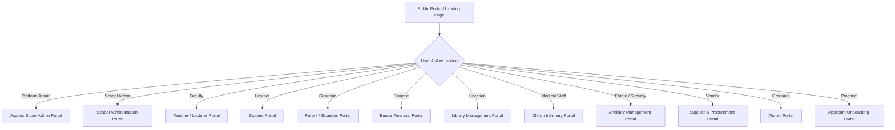
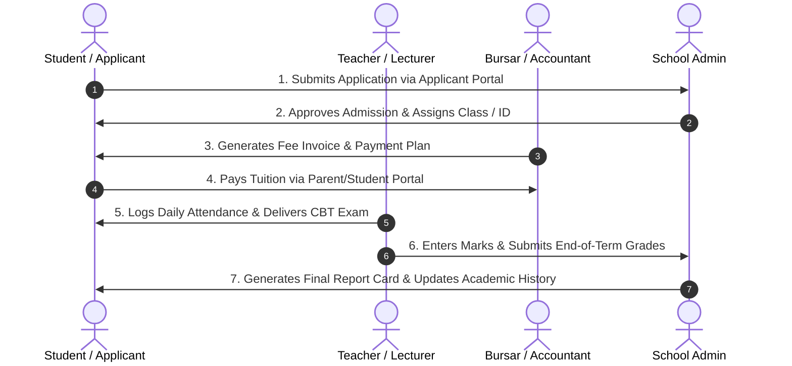

# SKULAS School ERP — End-to-End System User Flow Guide

## Executive Overview

**SKULAS ERP** is an enterprise-grade, multi-tenant Educational Resource Planning system designed to support institutions across all educational tiers—ranging from Primary & Secondary K-12 Schools to Tertiary Universities, Nursing Colleges, Polytechnics, and Seminaries.

The platform provides role-tailored web portals backed by dynamic terminology translation (`useTerminology`), ensuring every user role interacts with an intuitive interface matching their specific operational workflows.

---

---

## 1. Multi-Tenant Architecture & Domain Terminology

### 1.1 Tenant Isolation & Access Routes
- Every registered institution receives a unique `schoolCode` (e.g., `SUNRISE-ACADEMY`, `AX-SEMINARY`).
- Public Website URLs follow the format: `https://domain.com/school/:schoolCode`.
- Short direct links automatically route from `https://domain.com/:schoolCode` to the institution's public portal.
- All user authentications are validated against `schoolId` to maintain strict data privacy across tenants.

### 1.2 Dynamic School-Type Terminology Matrix

| Generic Term | K-12 Primary School | Secondary / High School | Tertiary / University | Nursing College | Seminary |
| :--- | :--- | :--- | :--- | :--- | :--- |
| **Class** | Class | Form / Class | Cohort / Class | Clinical Group | Formation Year |
| **Teacher** | Teacher | Teacher | Lecturer / Professor | Instructor | Formator |
| **Subject** | Subject | Subject | Course / Module | Module | Theology Module |
| **Grade** | Grade | Form / Level | Year / Part | Academic Level | Formation Level |
| **Migration** | Migrate Class | Migrate Class | Migrate Cohort | Migrate Cohort | Migrate Cohort |
| **Governance**| SDC | SDC / Board | Senate / Council | Advisory Board | Board of Formators |
| **Parent** | Parent / Guardian | Parent / Guardian | Sponsor / Guardian | Next of Kin | Diocese / Order |

---

## 2. Portal User Flows & Operational Journeys

---

### 🏛️ 1. Platform Super Admin Portal (`/acadex`)
**Target User**: System Engineers, Platform Operators, Technical Administrators.

#### Core Flow & Capabilities:
1. **Tenant Provisioning**: Register new schools, auto-generate initial admin credentials, and assign custom domain prefixes.
2. **Subscription Management**: Configure billing tiers (Basic, Standard, Enterprise), module permissions, and active license dates.
3. **Platform Monitoring**: Review real-time system logs, database health, API latency, and tenant activity metrics.
4. **Global Analytics**: Oversee total active students, staff counts, and transaction throughput across all registered institutions.

---

### 🛡️ 2. School Administration Portal (`/admin`)
**Target User**: School Principals, Headmasters, Deans, Registrar Staff.

#### Core Flow & Capabilities:
1. **Institutional Setup Wizard**:
   - Step 1: Regional & System Preferences (Currency, Timezone, School Type).
   - Step 2: Branding (Logo, Favicon, Color Tokens, Header/Footer Templates).
   - Step 3: Public Website Configuration & Noticeboard Controls.
   - Step 4: ID Card Generation & Financial Document Templates.
2. **User Lifecycle Governance**:
   - Onboard Students, Teachers, Bursars, Librarians, Ancillary Staff, Suppliers, and Clinic Personnel via `AdminUserCreateModal`.
   - Manage role-based access control (RBAC) and assign up to 4 secondary roles per staff member.
3. **Academic Infrastructure**:
   - Manage Classes, Sections (Morning/Afternoon sessions), and Subject Catalogs.
   - Execute bulk **Class / Cohort Migration** with target class mapping.
   - Build Master Timetables and analyze Teacher Load metrics.
4. **Financial & HR Control**:
   - Establish Chart of Accounts (COA), Fee Groups, and Revenue Allocation rules.
   - Manage job vacancies, incoming applications, payroll runs, and staff leave approvals.
5. **Asset & Estate Management**:
   - Monitor school transport routes, vehicle assignments, and hostel dormitories.
   - Log IT helpdesk tickets and manage asset maintenance schedules.

---

### 👩‍🏫 3. Teacher & Academic Faculty Portal (`/teacher`)
**Target User**: Class Teachers, Subject Teachers, Department Heads, Academic Supervisors.

#### Core Flow & Capabilities:
1. **Classroom Management & Attendance**:
   - View assigned classes and student rosters.
   - Log daily student attendance manually, bulk mark, or scan QR codes via mobile.
   - Track clock-in/out logs for staff attendance compliance.
2. **Curriculum & Lesson Delivery**:
   - Build termly syllabi using `SyllabusManager`.
   - Upload lesson plans, lecture slides, digital resources, and recommended textbook lists.
   - Launch live virtual classrooms via integrated **Zoom** or **Jitsi Meet**.
3. **Continuous Assessment & CBT Exams**:
   - Create online CBT (Computer-Based Testing) exams, question banks, and auto-grading rules.
   - Build printable question papers using `QuestionPaperBuilder`.
   - Input continuous assessment (CA) marks and term exam scores in `MarksEntryPage`.
   - Submit principal comments and conduct reports.
4. **Faculty HR Self-Service**:
   - Request leave, view awarded staff recognitions, and download monthly payslips.
   - Submit procurement requisitions for classroom materials.

---

### 🎓 4. Student Portal (`/student`)
**Target User**: Enrolled Learners, Undergraduates, Student Nurses, Seminarians.

#### Core Flow & Capabilities:
1. **Academic Dashboard**:
   - View daily class timetable, subject announcements, and upcoming assessment deadlines.
   - Access course study materials, lecture notes, and digital library resources.
2. **Assignments & CBT Assessment Center**:
   - Submit digital homework and project assignments before cut-off deadlines.
   - Take timed CBT exams online with instant score breakdown and progress tracking.
3. **E-Library & Resource Hub**:
   - Search the library book catalog, reserve physical books, and access digital repository PDFs.
4. **Financial Ledger & Self-Service**:
   - View fee statements, breakdown of tuition/boarding fees, and download official receipt receipts.
   - Access formal digital Admission Letters.
5. **Campus Life & Extracurriculars**:
   - Participate in House Management competitions, Prefect Council activities, and Student Clubs.
   - Submit health complaints or book appointment slots with the school clinic.

---

### 👨‍👩‍👧 5. Parent / Guardian Portal (`/parent`)
**Target User**: Parents, Legal Guardians, Next of Kin, Financial Sponsors.

#### Core Flow & Capabilities:
1. **Multi-Ward Dashboard**:
   - Seamlessly switch between multiple children enrolled at the institution.
2. **Academic & Conduct Tracking**:
   - Review real-time daily class attendance, tardiness records, and disciplinary notices.
   - View end-of-term academic report cards, continuous assessment scores, and teacher comments.
3. **Financial Management & Wallet**:
   - View outstanding fee balances, invoice histories, and structured payment plan installments.
   - Make online tuition payments via credit card, mobile money, or digital wallet top-ups.
4. **Communication & Approvals**:
   - Receive school announcements, calendar event invites, and approve field trip consent forms.

---

### 💰 6. Bursar & Financial Portal (`/bursar`)
**Target User**: Chief Bursar, Finance Officers, Accountants, Accounts Clerks.

#### Core Flow & Capabilities:
1. **Chart of Accounts (COA) & General Ledger**:
   - Maintain double-entry ledger accounts, income channels, expenses, liabilities, and assets.
   - Perform bank reconciliation and generate real-time Trial Balance, Income Statement, and Balance Sheet reports.
2. **Fee Invoicing & Payment Processing**:
   - Generate individual and bulk student fee invoices based on Fee Groups.
   - Record manual cash/bank transfers, issue receipt vouchers, and manage payment plans.
   - Run automated fee reminder notifications and log dispatch histories.
3. **Payroll & Compensation Operations**:
   - Configure salary structures, tax tables (ZIMRA/PAYE), pension contributions (NSSA), and USD/ZiG currency splits.
   - Execute monthly payroll runs and generate digital employee payslips.
4. **Tuckshop & POS Management**:
   - Manage Tuckshop stock inventory, point-of-sale (POS) daily cash receipts, and sales summary reports.
5. **SDC Financial Auditing**:
   - Track School Development Committee (SDC) funding allocations, project expenditures, and audit meeting minutes.

---

### 📚 7. Library Portal (`/library`)
**Target User**: Head Librarian, Assistant Librarians, Media Center Staff.

#### Core Flow & Capabilities:
1. **Catalog & Inventory Control**:
   - Catalog books by ISBN, author, category, publisher, shelf locator, and barcode.
   - Manage e-books and digital resource repository uploads.
2. **Circulation & Loan Operations**:
   - Process book checkouts and returns for students and teachers.
   - Track active loans, issue extension approvals, and calculate overdue fine penalties.
3. **Analytics & Reports**:
   - Generate reports on most borrowed titles, lost book penalties, and category utilization metrics.

---

### 🩺 8. Clinic & Infirmary Portal (`/clinic`)
**Target User**: School Medical Officers, Registered Nurses, Infirmary Staff.

#### Core Flow & Capabilities:
1. **Triage & Consultation Flow**:
   - Log student/staff walk-in health complaints and conduct initial vital sign triage.
   - Record diagnosis using standard **ICD-10** medical classification coding.
2. **Hospitalization & Infirmary Management**:
   - Admit ill students to infirmary beds, assign medical staff monitoring, and track discharge status.
3. **Pharmacy & Prescriptions**:
   - Dispense medications from the school pharmacy inventory and track batch expiration dates.
   - Issue clinic billing slips for specialized medical supplies.
4. **Immunization & Emergency Governance**:
   - Track student vaccination schedules, record emergency hospital referrals, and notify parents immediately.

---

### 🛠️ 9. Ancillary & Estate Operations Portal (`/ancillary`)
**Target User**: Facilities Manager, Security Personnel, Matrons/Warden Staff, Kitchen Supervisor.

#### Core Flow & Capabilities:
1. **Security & Visitor Governance**:
   - Maintain digital Visitor Book logs, record vehicle license plates, and track visitor sign-in/out times.
   - Log security incidents, gate passes, and student exeat permissions.
2. **Boarding & Hostel Operations**:
   - Configure hostel categories, room numbers, bed capacities, and student room assignments.
3. **Dining Hall & Kitchen Operations**:
   - Manage daily meal plans, food inventory stock, and track dietary restriction registers.
4. **Front Desk & Facilities**:
   - Log visitor complaints, phone calls, and submit facility maintenance work orders.

---

### 🏬 10. Supplier & Vendor Portal (`/supplier`)
**Target User**: Approved Commercial Suppliers, Contractors, Service Providers.

#### Core Flow & Capabilities:
1. **Vendor Compliance Profile**:
   - Maintain PRAZ registration certificates, NSSA compliance, Tax Clearances, and BP details.
2. **Procurement & Bidding**:
   - Browse open school tender requests and submit formal price quotations.
   - Track awarded purchase orders and contract milestone fulfillment.
3. **Invoicing & Payments**:
   - Upload delivery notes and formal invoices, tracking payment clearance status from the Bursar's office.

---

### 🎓 11. Alumni Network Portal (`/alumni`)
**Target User**: Graduated Students, Alumni Association Executive Members.

#### Core Flow & Capabilities:
1. **Graduate Directory**:
   - Maintain post-graduation contact details, current employment status, and professional achievements.
2. **Transcripts & Verification**:
   - Request official academic transcript re-issues and degree/diploma verification certificates.
3. **Events & Development**:
   - RSVP for alumni reunions, contribute to school development fundraising campaigns, and mentor current students.

---

### 📋 12. Applicant & Onboarding Portal (`/applicant`)
**Target User**: Prospective Students, New Applicants.

#### Core Flow & Capabilities:
1. **Online Application Submission**:
   - Fill out admission forms, select preferred program/grade, and upload supporting documents (Birth Certificate, Previous Academic Reports, Transfer Certificates).
2. **Application Tracking**:
   - Monitor real-time status (`Submitted` → `Under Review` → `Interview Scheduled` → `Accepted`).
3. **Interview & Enrollment**:
   - Confirm interview appointment dates and accept formal Admission Offers.

---

## 3. Cross-Portal Integration Matrix

---

## Summary of Operational Benefits
- **Unified Governance**: Single source of truth for academic, financial, medical, and administrative records.
- **Strict Compliance**: Fully aligns with institutional regulations, ZIMRA tax requirements, and PRAZ supplier standards.
- **Dynamic Localization**: Instantly adapts UI terminology to match primary, high school, university, nursing, or seminary contexts.
